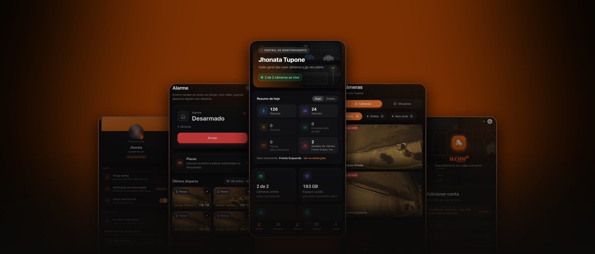

  

Câmeras ao vivo, alarme com sirene e mosaicos. No computador e no celular.

  

<table align="center">
  <tr>
    <td align="center" width="170">
      
    </td>
    <td align="center" width="170">
      
    </td>
    <td align="center" width="170">
      
    </td>
    <td align="center" width="170">
      
    </td>
  </tr>
</table>

  &nbsp;
  <b>Técnico?</b> Instalador de câmeras:
  <a href="https://github.com/Jhonata-php/wcam-desktop/releases/latest/download/WCAM-Instalador.exe">Windows</a> ·
  <a href="https://github.com/Jhonata-php/wcam-desktop/releases/latest/download/WCAM-Instalador-mac.dmg">Mac</a>

 

<b>Como instalar</b>

 

**Windows:** abra o arquivo. Se aparecer *"O Windows protegeu o computador"*, clique em **Mais informações → Executar assim mesmo**.

**Mac:** abra o `.dmg` e arraste o WCAM para Aplicativos. Na primeira vez, clique com o **botão direito** no app → **Abrir**.

**Android:** abra o `.apk` baixado. Se pedir, permita **instalar apps desta fonte**. Também roda em Android TV.

**iPhone:** abra o portal no **Safari** → **Compartilhar** → **Adicionar à Tela de Início**. O WCAM fica na tela como app.

Depois é só entrar com o e-mail e a senha do portal WCAM. O app se atualiza sozinho.

